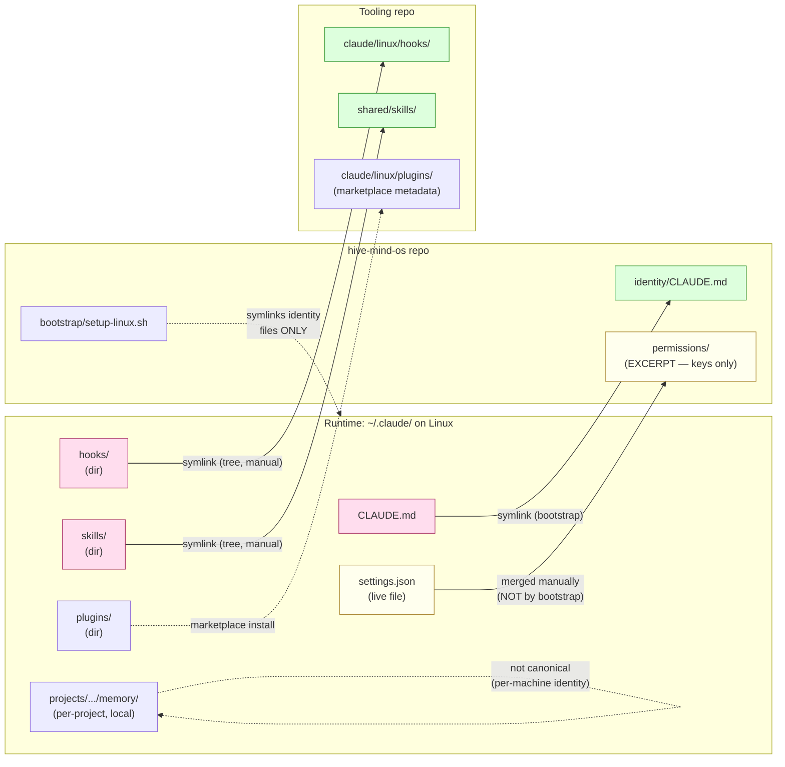
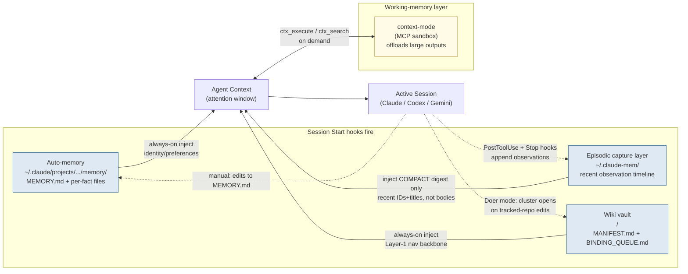
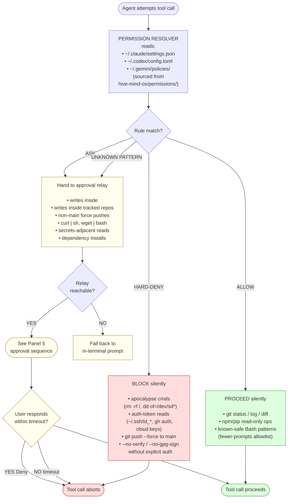
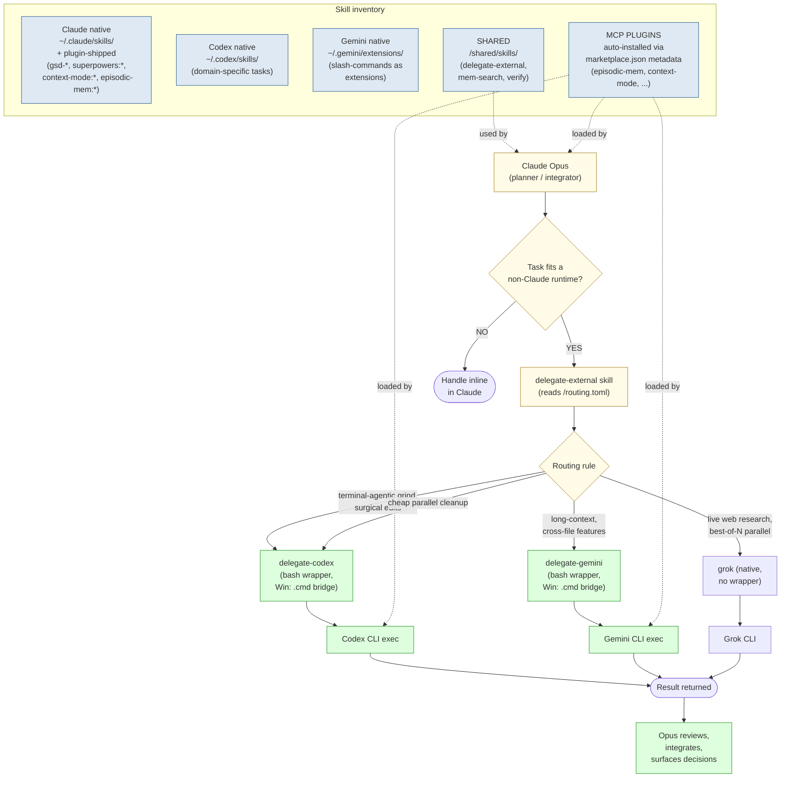
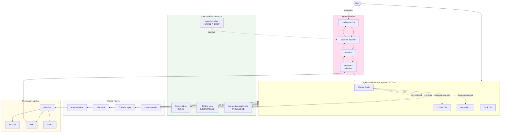

# Agent Infrastructure — Unified Reference

> **TL;DR (≤80 words):** Seven Mermaid diagrams + tables giving the full picture
> of how the cross-agent stack interlocks. Four runtimes (Claude / Codex /
> Gemini / Grok) on two OSes (Linux WSL + Windows) are unified via symlinks into four
> canonical GitHub repos — rules, executables, knowledge, human-in-the-loop.
> Memory is three durable layers plus an always-on working-memory layer (context-mode), requests
> flow through a permission pipeline that escalates to a relay for human approval,
> and the orchestrator delegates to specialists via `routing.toml`.

## How to read this document

Seven Mermaid diagrams, progressively zoomed. Each is self-contained — read in
order for the full story, or jump to the section you need. Diagrams render
natively in Obsidian (live preview), GitHub, and any modern markdown viewer.
Tables at the end pull file-paths and per-agent surfaces out of the panels for
one-stop reference.

Companion docs:
- `memory-architecture.md` — deeper on the memory layers (Panel 3)
- `permissions-protocol.md` — deeper on the permission resolver (Panel 4)
- `human-in-the-loop.md` — deeper on the approval relay (Panel 5)

---

## 1. The fleet — four agents, two OSes, one logical machine

The user talks to any of four CLI agents. Each runs on both Linux (WSL) and
Windows. All eight runtimes pull rules + executables from the same canonical
GitHub repos via symlinks, so identity / hooks / skills stay consistent across
OSes.

```mermaid
flowchart TB
    USER([User<br/>terminal + phone])

    subgraph LIN[Linux WSL side]
        direction LR
        CC_L["Claude Code<br/>~/.claude/<br/>(orchestrator)"]
        CX_L["Codex CLI<br/>~/.codex/<br/>(terminal-grind specialist)"]
        GM_L["Gemini CLI<br/>~/.gemini/<br/>(long-context specialist)"]
        GK_L["Grok CLI<br/>~/.grok/<br/>(Claude-compat agent)"]
    end

    subgraph WIN[Windows side]
        direction LR
        CC_W["Claude Code<br/><your-home>/.claude/"]
        CX_W["Codex CLI<br/><your-home>/.codex/"]
        GM_W["Gemini CLI<br/><your-home>/.gemini/"]
        GK_W["Grok CLI<br/><your-home>/.grok/"]
    end

    USER --> CC_L
    USER --> CX_L
    USER --> GM_L
    USER --> GK_L
    USER --> CC_W
    USER --> CX_W
    USER --> GM_W
    USER --> GK_W

    subgraph REPOS[Canonical repos — github.com/your-org/*]
        direction LR
        AHM["hive-mind-os<br/>(RULES)<br/>identity files,<br/>permission excerpts,<br/>protocol docs"]
        ATOOL["Tooling repo<br/>(EXECUTABLES)<br/>hooks, bins,<br/>routing.toml,<br/>shared skills"]
        WIKI["Knowledge-graph repo<br/>(KNOWLEDGE)<br/>wiki vault,<br/>topic hubs,<br/>clusters, sources"]
        RELAY["approval-relay<br/>(HUMAN-IN-LOOP)<br/>daemon, adapters,<br/>mailbox"]
    end

    CC_L -.symlinks.-> AHM
    CX_L -.symlinks.-> AHM
    GM_L -.symlinks.-> AHM
    GK_L -.symlinks.-> AHM
    CC_W -.symlinks.-> AHM
    CX_W -.symlinks.-> AHM
    GM_W -.symlinks.-> AHM
    GK_W -.symlinks.-> AHM

    CC_L -.symlinks.-> ATOOL
    CX_L -.symlinks.-> ATOOL
    GM_L -.symlinks.-> ATOOL
    GK_L -.symlinks.-> ATOOL
    CC_W -.symlinks.-> ATOOL
    CX_W -.symlinks.-> ATOOL
    GM_W -.symlinks.-> ATOOL
    GK_W -.symlinks.-> ATOOL

    CC_L -.symlinks.-> WIKI
    CC_W -.symlinks.-> WIKI

    CC_L -.IPC.-> RELAY
    CX_L -.IPC.-> RELAY
    GM_L -.IPC.-> RELAY
    GK_L -.IPC.-> RELAY

    classDef linux fill:#dfe9f3,stroke:#369
    classDef win fill:#f5e6d8,stroke:#a36
    classDef repo fill:#dfd,stroke:#393,stroke-width:2px
    class CC_L,CX_L,GM_L,GK_L linux
    class CC_W,CX_W,GM_W,GK_W win
    class AHM,ATOOL,WIKI,RELAY repo
```



**Why four repos, not one:** different lifecycles. Rules change rarely and need
audit (hive-mind-os). Executables are code and want tests (tooling repo).
Knowledge wants curation but no execution (knowledge-graph repo). The relay is
its own deployable daemon (approval-relay). Mixing them muddles change-review
discipline.

---

## 2. Symlink topology — how a runtime directory maps to canonical

Zoom in on one runtime (Claude Code, Linux). Identity is full-file symlinked
**by the bootstrap**; hooks/skills are tree-symlinked and permission settings
are *merged* as **separate manual steps** (canonical holds excerpts because live
files also carry machine-specific stuff like MCP servers). The bootstrap
installs the identity symlink only — it does not merge permissions or symlink
hooks.



**Bootstrap rule:** the bootstrap *symlinks the identity files only* (single
canonical source of truth). Permission settings get *merged* and hooks/skills
get tree-symlinked as **separate manual steps you run after** — the live
settings file keeps MCP/plugin keys while only permission keys are versioned.
Per-project memory stays local — identity for the machine, not the fleet. Same
pattern repeats for Codex (`~/.codex/`), Gemini (`~/.gemini/`), and the Windows
side.

---

## 3. Memory architecture — three durable layers + the working-memory layer

How memory feeds the agent. Three injection sources fire at session start;
context-mode runs alongside the agent every session for token-economy.



**Distinction (and the promotion path):**
- **Auto-memory** — small, deterministic, *always loaded*. "Who I am, how I work."
- **Wiki vault** — curated, walkable, *always injected at Layer 1 only* (manifest); deeper layers walked on demand. "I've gone down this trail before."
- **Episodic capture layer** — full episodic record. A **compact recent-observation digest** (IDs + titles + timestamps — a navigation index, like the wiki manifest) *is* auto-injected at session start; the **full bodies are never auto-injected** — they are pulled only on cue (e.g. via `mem-search`). "The journal, with its table of contents on the desk." Note the diagram arrow above: what fires at session start is the digest, not the record.
- **context-mode** — working-memory; not durable. Findings get *promoted* upward into the other three.

---

## 4. Permission pipeline — the safeguard

Every tool call passes the resolver. Three outcomes: silent allow, hard deny, or
ASK — which escalates to the approval relay (Panel 5).



**Default-safe defaults:** `defaultMode=auto` + unrecognized pattern → ASK
(safer than ALLOW). Relay unreachable → terminal fallback (never blocks
indefinitely). Timeout always → DENY (never silently auto-approves).

---

## 5. Approval relay — sequence

What happens when an ASK rule escalates. Same daemon handles three payload
types (approval, question, notification).

```mermaid
sequenceDiagram
    participant Agent as Agent runtime<br/>(Claude/Codex/Gemini)
    participant Adapter as Per-agent adapter<br/>(approval-relay/adapters/)
    participant MBox as mailbox/<br/>(JSON files)
    participant Daemon as approver daemon<br/>(systemd, Python)
    participant Bot as Notification API<br/>(e.g. Telegram Bot)
    participant Phone as User's phone

    Agent->>Adapter: ASK-rule triggered<br/>(tool, args, request_id)
    Adapter->>MBox: atomic write<br/>&lt;id&gt;.json
    MBox-->>Daemon: inotify event
    Daemon->>Bot: sendMessage<br/>(text + inline keyboard)
    Bot->>Phone: notification<br/>(Approve / Deny buttons)

    alt User approves within timeout
        Phone->>Bot: tap "Approve"
        Bot-->>Daemon: callback_query
        Daemon->>MBox: write &lt;id&gt;.reply<br/>(approved=true)
        MBox-->>Adapter: file appears
        Adapter-->>Agent: unblock tool call
        Agent->>Agent: tool executes
    else User denies
        Phone->>Bot: tap "Deny"
        Bot-->>Daemon: callback_query
        Daemon->>MBox: write &lt;id&gt;.reply<br/>(approved=false)
        Adapter-->>Agent: abort tool call
    else Timeout (configurable; ref ~23h)
        Note over Daemon: no callback received
        Daemon->>MBox: write &lt;id&gt;.reply<br/>(approved=false, reason=timeout)
        Adapter-->>Agent: abort tool call (DENY)
    end
```

**Payload types** (same pipeline, different keyboard):
- **approval** — yes/no buttons (the diagram above)
- **question** — multi-choice buttons or free-text reply
- **notification** — no buttons, fire-and-forget

**Failure modes handled:** daemon dead → adapter falls back to terminal prompt;
notification API down → exponential backoff then terminal fallback; ambiguous
reply → re-ask once then deny.

---

## 6. Skills, plugins & delegation routing

How the orchestrator (Claude Opus) hands work to specialist runtimes, and how
shared skills + MCP plugins fit in.



**Why bash wrappers and not in-Claude tool calls:** Codex / Gemini run as their
own processes with their own permission models and sandboxes. The wrappers
(`delegate-codex`, `delegate-gemini` — and `.cmd` bridges on Windows) provide a
single stable interface that survives version bumps in either CLI. **Grok has no
wrapper** — it is driven natively (`grok -p` / `--prompt-file`), because the same
`.cmd`→WSL bridge the others use is unreliable on some Windows setups; read-only
dispatches are made safe by allowing only read tools and stripping mutating ones.

---

## 7. The complete system — one view

Everything in one diagram. Use this when you need to see how a change in one
component affects the others.



Every component referenced in panels 1–6 appears here once, connected. The
fleet stays consistent because every runtime arrow into a canonical repo is a
symlink (or merge target), not a copy.

---

## Canonical repos at a glance

| Repo | What it holds | Why it exists |
|---|---|---|
| `hive-mind-os` | identity files, permission excerpts, protocol docs | the **rules** layer — what each agent reads at startup |
| Tooling repo | hooks, custom bins, routing.toml, shared skills, plugin metadata | the **executables** layer — runnable code shared across agents; lives in a separate repo from this one |
| Knowledge-graph vault | wiki vault — topic hubs, clusters, sources | the **knowledge** layer — semantic memory; this repo ships a starter template under `wiki-template/` |
| `approval-relay` | daemon, adapters, mailbox protocol, systemd units | the **human-in-the-loop** layer |
| Local model server | tuned launch config for a local GGUF server (weights/build not versioned) | the **executor** layer — decision-free local grunt work; companion, pattern in `docs/executor-tier.md` |

## Per-agent surface area (what each runtime exposes)

| Surface | Claude Code | Codex CLI | Gemini CLI |
|---|---|---|---|
| Identity file | `~/.claude/CLAUDE.md` | `~/.codex/AGENTS.md` | `~/.gemini/GEMINI.md` |
| Permission settings | `~/.claude/settings.json` | `~/.codex/config.toml` | `~/.gemini/settings.json` + `~/.gemini/policies/` |
| Hooks | `~/.claude/hooks/` | `~/.codex/hooks/` | (via extensions) |
| Skills | `~/.claude/skills/` + plugin-shipped | `~/.codex/skills/` | `~/.gemini/extensions/` |
| Plugins / marketplaces | `settings.json` marketplaces | `config.toml` marketplaces | extensions |
| Auto-memory | `~/.claude/projects/<p>/memory/` | (none — in AGENTS.md) | (none — in GEMINI.md) |
| Adapter for approval relay | `approval-relay/adapters/claude/` | `approval-relay/adapters/codex/` | `approval-relay/adapters/gemini/` |

## Where everything lives — file map

| What | Path |
|---|---|
| **Canonical repos root** | `<your-home>/` (adapt to your filesystem) |
| hive-mind-os | `<your-home>/hive-mind-os/` |
| Tooling repo | `<your-home>/<tooling-repo>/` (separate companion repo) |
| Knowledge-graph vault | `<your-home>/Obsidian/` (or your chosen vault root) |
| Knowledge-graph vault (Linux view) | `<vault>/` (symlinked or native) |
| approval-relay | `<your-home>/approval-relay/` |
| Identity sources (OS-agnostic) | `hive-mind-os/identity/{CLAUDE,AGENTS,GEMINI,GROK}.md` |
| Permission excerpts | `hive-mind-os/permissions/` |
| Bootstrap scripts | `hive-mind-os/bootstrap/{bootstrap.py, setup-linux.sh, setup-windows.ps1}` |
| Shared skills | `<tooling-repo>/shared/skills/` |
| Delegation wrappers | `<tooling-repo>/bin/{delegate-codex,delegate-gemini}` |
| Routing rules | `<tooling-repo>/{claude,codex,gemini}/routing.toml` |
| Relay daemon | `<your-home>/approval-relay/daemon.py` |
| systemd unit | `<your-home>/approval-relay/systemd/approver.service` |
| Mailbox | `<your-home>/approval-relay/mailbox/` |
| Episodic capture store | `~/.claude-mem/observations.db` (tool-dependent) |
| Auto-memory root | `~/.claude/projects/<project>/memory/MEMORY.md` |
| Wiki SessionStart hook | `<vault>/scripts/session_start_hook.py` |

---

## The three rules, in one paragraph

**Rule 1 (symlink discipline):** every runtime directory is either a full-file
symlink, a tree symlink, or a merge target into a canonical repo. New machines
join the fleet by running one bootstrap script per OS; everything else flows
from `git pull`.

**Rule 2 (permission discipline):** every tool call passes the resolver. Hard
deny is silent. Allow is silent. Ask escalates to the relay with a timeout that
defaults to deny. Relay unreachable falls back to terminal — the agent never
silently auto-approves.

**Rule 3 (memory discipline):** auto-memory is always loaded (identity). Wiki
Layer 1 (manifest) is always loaded; deeper layers are walked on demand per the
Wiki Protocol. The episodic layer is cued retrieval only. Context-mode is
working memory; durable findings get promoted upward.

Three rules, four runtimes (eight instances across two OSes), four repos, one logical machine.
