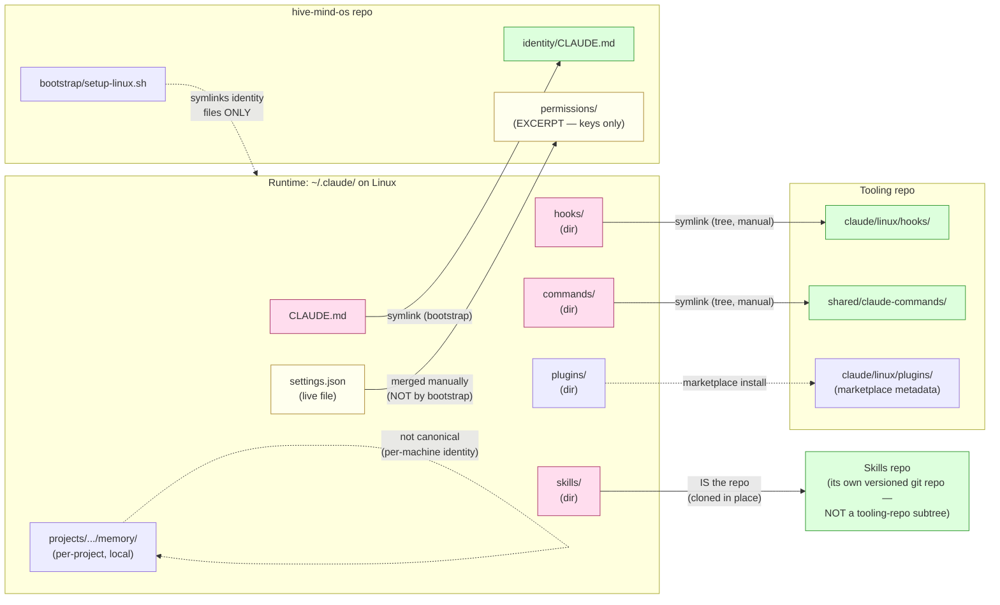
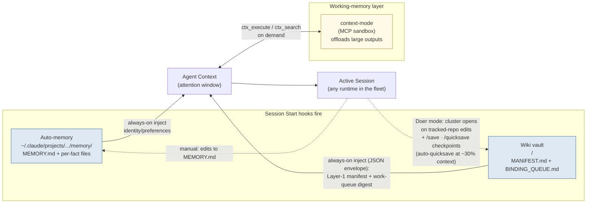
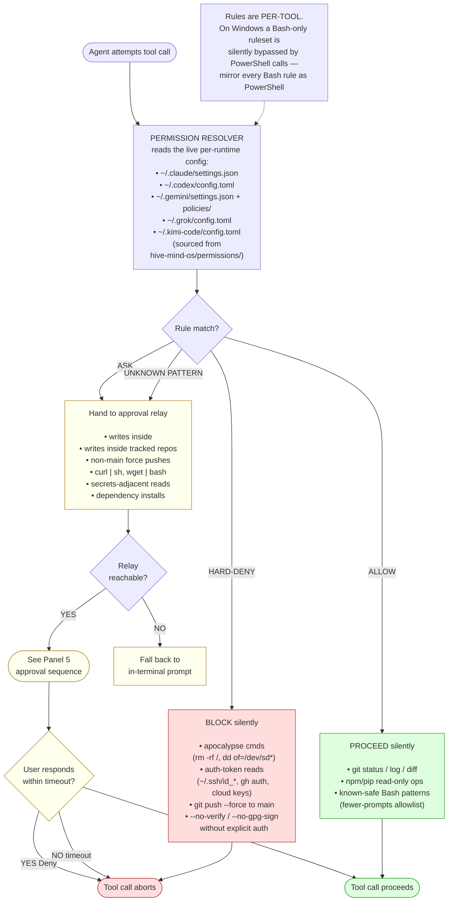
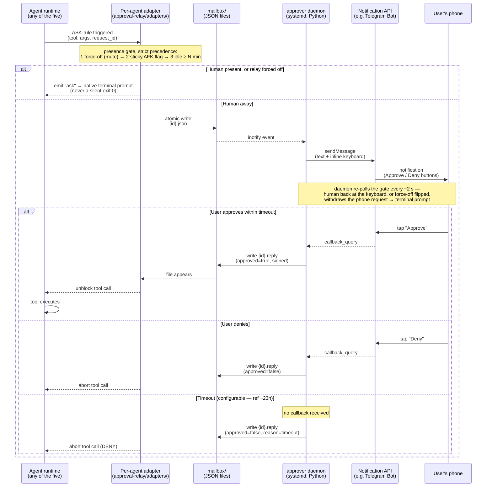
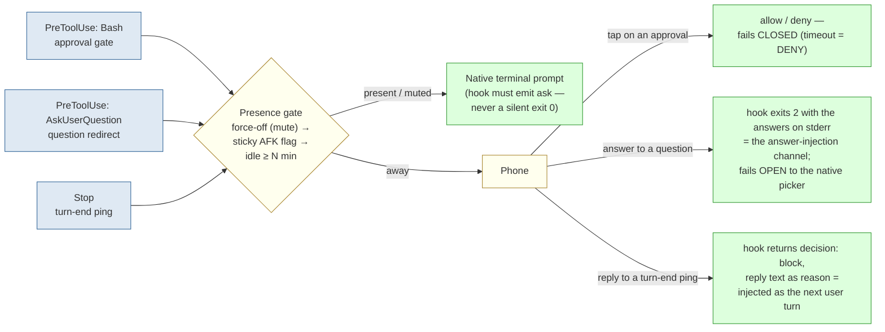
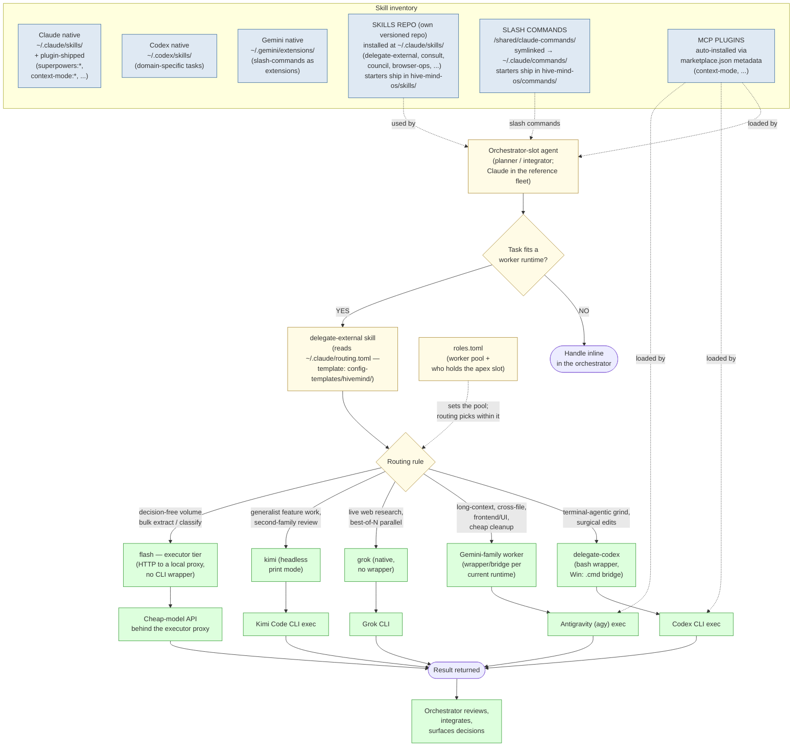
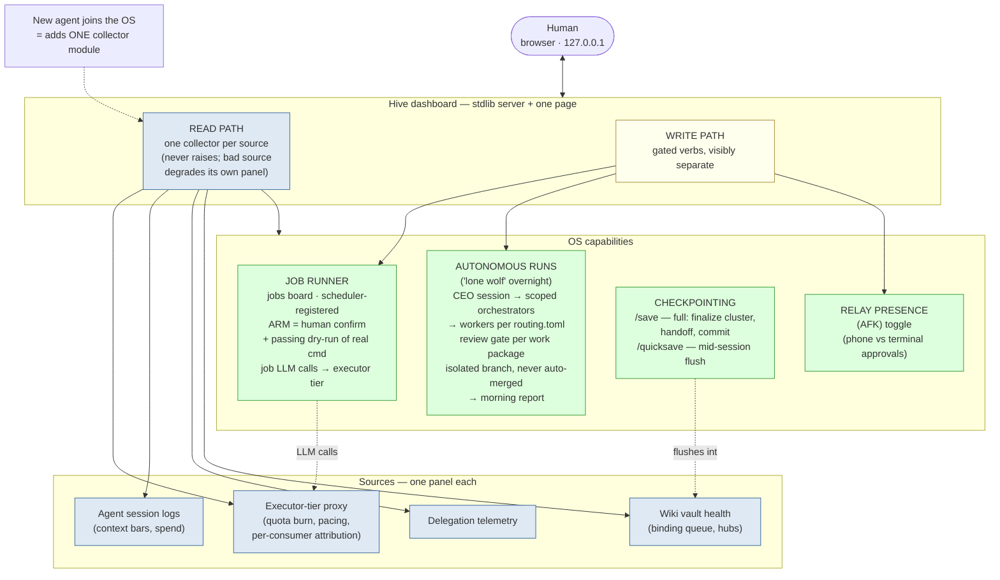

# Agent Infrastructure — Unified Reference

> **TL;DR (≤80 words):** Nine Mermaid diagrams + tables giving the full picture
> of how the cross-agent stack interlocks. Five runtimes (Claude / Codex /
> Gemini-family `agy` / Grok / Kimi) on two OSes (Linux WSL + Windows) are unified via symlinks into four
> canonical GitHub repos — rules, executables, knowledge, human-in-the-loop.
> Memory is two durable layers plus an always-on working-memory layer (context-mode), requests
> flow through a permission pipeline that escalates to a relay for human approval,
> the orchestrator-slot agent delegates via `routing.toml`, and a local dashboard is the OS's UI.

## How to read this document

Nine Mermaid diagrams across eight numbered panels, progressively zoomed (Panel
5 carries two: the approval sequence and the hook-surface map). Each is
self-contained — read in order for the full story, or jump to the section you
need. Diagrams render
natively in Obsidian (live preview), GitHub, and any modern markdown viewer.
Tables at the end pull file-paths and per-agent surfaces out of the panels for
one-stop reference.

Companion docs:
- `memory-architecture.md` — deeper on the memory layers (Panel 3)
- `permissions-protocol.md` — deeper on the permission resolver (Panel 4)
- `human-in-the-loop.md` — deeper on the approval relay (Panel 5)
- `observability.md` — deeper on the dashboard / OS layer (Panel 7)

---

## 1. The fleet — five agents, two OSes, one logical machine

The user talks to any of five CLI agents. Each runs on both Linux (WSL) and
Windows. All runtime instances pull rules + executables from the same canonical
GitHub repos via symlinks, so identity / hooks / skills stay consistent across
OSes.

> **Naming note (kept honest):** the Gemini-family worker is **Antigravity
> (`agy`)**. The consumer `gemini` npm CLI shut down on 2026-06-18; the
> reference fleet migrated to Antigravity, which runs the same model family,
> and the `GEMINI.md` identity file was simply re-pointed
> (`docs/multi-runtime.md`, "Runtimes die; identity files don't").

> **Adopting on macOS?** This diagram is the *author's* rig (Linux WSL +
> Windows). The doctrine is OS-agnostic: macOS is native Unix, so it follows the
> Linux path directly — `bash bootstrap/setup-macos.sh`, native symlinks with no
> privilege needed, and **no WSL**. The Mac-specific divergences (python3 stub,
> BSD-vs-GNU coreutils in companion scripts, Metal-accelerated local-inference
> executor alternative) are documented in the header of `bootstrap/setup-macos.sh`.

```mermaid
flowchart TB
    USER([User<br/>terminal + phone])

    subgraph LIN[Linux WSL side]
        direction LR
        CC_L["Claude Code<br/>~/.claude/<br/>(orchestrator slot, ref.)"]
        CX_L["Codex CLI<br/>~/.codex/<br/>(terminal-grind specialist)"]
        GM_L["Gemini-family worker (agy)<br/>~/.gemini/<br/>(long-context specialist)"]
        GK_L["Grok CLI<br/>~/.grok/<br/>(Claude-compat agent)"]
        KM_L["Kimi Code CLI<br/>~/AGENTS.md<br/>(generalist / CEO slot, ref.)"]
    end

    subgraph WIN[Windows side]
        direction LR
        CC_W["Claude Code<br/><your-home>/.claude/"]
        CX_W["Codex CLI<br/><your-home>/.codex/"]
        GM_W["Gemini-family worker (agy)<br/><your-home>/.gemini/"]
        GK_W["Grok CLI<br/><your-home>/.grok/"]
        KM_W["Kimi Code CLI<br/><your-home>/AGENTS.md"]
    end

    USER --> CC_L
    USER --> CX_L
    USER --> GM_L
    USER --> GK_L
    USER --> KM_L
    USER --> CC_W
    USER --> CX_W
    USER --> GM_W
    USER --> GK_W
    USER --> KM_W

    subgraph REPOS[Canonical repos — github.com/your-org/*]
        direction LR
        AHM["hive-mind-os<br/>(RULES)<br/>identity files,<br/>permission excerpts,<br/>protocol docs"]
        ATOOL["Tooling repo<br/>(EXECUTABLES)<br/>hooks, bins,<br/>slash commands,<br/>role control plane"]
        WIKI["Knowledge-graph repo<br/>(KNOWLEDGE)<br/>wiki vault,<br/>topic hubs,<br/>clusters, sources"]
        RELAY["approval-relay<br/>(HUMAN-IN-LOOP)<br/>daemon, adapters,<br/>mailbox"]
    end

    CC_L -.symlinks.-> AHM
    CX_L -.symlinks.-> AHM
    GM_L -.symlinks.-> AHM
    GK_L -.symlinks.-> AHM
    KM_L -.symlinks.-> AHM
    CC_W -.symlinks.-> AHM
    CX_W -.symlinks.-> AHM
    GM_W -.symlinks.-> AHM
    GK_W -.symlinks.-> AHM
    KM_W -.symlinks.-> AHM

    CC_L -.symlinks.-> ATOOL
    CX_L -.symlinks.-> ATOOL
    GM_L -.symlinks.-> ATOOL
    GK_L -.symlinks.-> ATOOL
    CC_W -.symlinks.-> ATOOL
    CX_W -.symlinks.-> ATOOL
    GM_W -.symlinks.-> ATOOL
    GK_W -.symlinks.-> ATOOL

    CC_L -.symlinks.-> WIKI
    CC_W -.symlinks.-> WIKI

    CC_L -.IPC.-> RELAY
    CX_L -.IPC.-> RELAY
    GM_L -.IPC.-> RELAY
    GK_L -.IPC.-> RELAY
    KM_L -.IPC.-> RELAY

    classDef linux fill:#dfe9f3,stroke:#369
    classDef win fill:#f5e6d8,stroke:#a36
    classDef repo fill:#dfd,stroke:#393,stroke-width:2px
    class CC_L,CX_L,GM_L,GK_L,KM_L linux
    class CC_W,CX_W,GM_W,GK_W,KM_W win
    class AHM,ATOOL,WIKI,RELAY repo
```

**Why four repos, not one:** different lifecycles. Rules change rarely and need
audit (hive-mind-os). Executables are code and want tests (tooling repo).
Knowledge wants curation but no execution (knowledge-graph repo). The relay is
its own deployable daemon (approval-relay). Mixing them muddles change-review
discipline.

---

## 2. Symlink topology — how a runtime directory maps to canonical

Zoom in on one runtime (Claude Code, Linux). Identity is full-file symlinked
**by the bootstrap**; hooks and slash commands are tree-symlinked, the skills
dir is its own git repo cloned in place (Panel 6), and permission settings
are *merged* as **separate manual steps** (canonical holds excerpts because live
files also carry machine-specific stuff like MCP servers). The bootstrap
installs the identity symlink only — it does not merge permissions or symlink
hooks.

```mermaid
flowchart LR
    subgraph RT[Runtime: ~/.claude/  on Linux]
        direction TB
        ID["CLAUDE.md"]
        ST["settings.json<br/>(live file)"]
        HK["hooks/<br/>(dir)"]
        SK["skills/<br/>(dir)"]
        CMD["commands/<br/>(dir)"]
        PL["plugins/<br/>(dir)"]
        MEM["projects/.../memory/<br/>(per-project, local)"]
    end

    subgraph AHM[hive-mind-os repo]
        direction TB
        AHM_ID["identity/CLAUDE.md"]
        AHM_PERM["permissions/<br/>(EXCERPT — keys only)"]
        AHM_BOOT["bootstrap/setup-linux.sh"]
    end

    subgraph ATOOL[Tooling repo]
        direction TB
        AT_HK["claude/linux/hooks/"]
        AT_CMD["shared/claude-commands/"]
        AT_PL["claude/linux/plugins/<br/>(marketplace metadata)"]
    end

    SKREPO["Skills repo<br/>(its own versioned git repo —<br/>NOT a tooling-repo subtree)"]

    ID -- "symlink (bootstrap)" --> AHM_ID
    HK -- "symlink (tree, manual)" --> AT_HK
    CMD -- "symlink (tree, manual)" --> AT_CMD
    SK -- "IS the repo<br/>(cloned in place)" --> SKREPO
    ST -- "merged manually<br/>(NOT by bootstrap)" --> AHM_PERM
    PL -. "marketplace install" .-> AT_PL
    MEM -. "not canonical<br/>(per-machine identity)" .-> MEM

    AHM_BOOT -. "symlinks identity<br/>files ONLY" .-> RT

    classDef live fill:#fde,stroke:#a36
    classDef canon fill:#dfd,stroke:#393
    classDef merge fill:#ffe,stroke:#a83
    class ID,HK,SK,CMD live
    class AHM_ID,AT_HK,AT_CMD,SKREPO canon
    class ST,AHM_PERM merge
```

**Bootstrap rule:** the bootstrap *symlinks the identity files only* (single
canonical source of truth). Permission settings get *merged* and hooks/commands
get tree-symlinked as **separate manual steps you run after** — the live
settings file keeps MCP/plugin keys while only permission keys are versioned.
Per-project memory stays local — identity for the machine, not the fleet. Same
pattern repeats for Codex (`~/.codex/`), Gemini (`~/.gemini/`), and the Windows
side.

---

## 3. Memory architecture — two durable layers + the working-memory layer

How memory feeds the agent. Two injection sources fire at session start;
context-mode runs alongside the agent every session for token-economy.
(A third injection source — an episodic capture layer — was retired in
2026-07 after an audit; see `docs/memory-architecture.md` for the evidence.)

```mermaid
flowchart LR
    subgraph SS[Session Start hooks fire]
        direction TB
        AM["Auto-memory<br/>~/.claude/projects/.../memory/<br/>MEMORY.md + per-fact files"]
        OW["Wiki vault<br/><vault>/<br/>MANIFEST.md + BINDING_QUEUE.md"]
    end

    AM -->|always-on inject<br/>identity/preferences| AC
    OW -->|"always-on inject (JSON envelope):<br/>Layer-1 manifest + work-queue digest"| AC

    AC["Agent Context<br/>(attention window)"]

    subgraph WM[Working-memory layer]
        CTX["context-mode<br/>(MCP sandbox)<br/>offloads large outputs"]
    end

    AC <-->|ctx_execute / ctx_search<br/>on demand| CTX
    AC --> ACT["Active Session<br/>(any runtime in the fleet)"]

    ACT -. "manual: edits to MEMORY.md" .-> AM
    ACT -. "Doer mode: cluster opens<br/>on tracked-repo edits<br/>+ /save · /quicksave checkpoints<br/>(auto-quicksave at ~30% context)" .-> OW

    classDef inject fill:#dfe9f3,stroke:#369
    classDef sandbox fill:#fffbe6,stroke:#a83
    class AM,OW inject
    class CTX sandbox
```

**Distinction (and the promotion path):**
- **Auto-memory** — small, deterministic, *always loaded*. "Who I am, how I work."
- **Wiki vault** — curated, walkable, *always injected at Layer 1 only* (manifest); deeper layers walked on demand. "I've gone down this trail before." Topic hubs carry the current state of every project; session state flushes in via the `/save` / `/quicksave` checkpoint workflow (auto-triggered at ~30% context used in the reference rig).
- **context-mode** — working-memory; not durable. Findings get *promoted* upward into the other two.

**Injection budget:** the session-start sources above are a standing per-session
token cost — audit it. The reference rig's 2026-07 lean pass cut injection from
~25.7k tokens (~13% of the context window) to under 10k by retiring the episodic
digest, slimming the wiki-state block, and pruning unused skills.

---

## 4. Permission pipeline — the safeguard

Every tool call passes the resolver. Three outcomes: silent allow, hard deny, or
ASK — which escalates to the approval relay (Panel 5).

```mermaid
flowchart TD
    Call([Agent attempts tool call])
    Call --> Resolver["PERMISSION RESOLVER<br/>reads the live per-runtime config:<br/>• ~/.claude/settings.json<br/>• ~/.codex/config.toml<br/>• ~/.gemini/settings.json + policies/<br/>• ~/.grok/config.toml<br/>• ~/.kimi-code/config.toml<br/>(sourced from<br/>hive-mind-os/permissions/)"]

    WinNote["Rules are PER-TOOL.<br/>On Windows a Bash-only ruleset is<br/>silently bypassed by PowerShell calls —<br/>mirror every Bash rule as PowerShell"]
    WinNote -.-> Resolver

    Resolver --> Match{Rule match?}

    Match -->|HARD-DENY| Deny["BLOCK silently<br/><br/>• apocalypse cmds<br/>  (rm -rf /, dd of=/dev/sd*)<br/>• auth-token reads<br/>  (~/.ssh/id_*, gh auth, cloud keys)<br/>• git push --force to main<br/>• --no-verify / --no-gpg-sign<br/>  without explicit auth"]

    Match -->|ALLOW| Allow["PROCEED silently<br/><br/>• git status / log / diff<br/>• npm/pip read-only ops<br/>• known-safe Bash patterns<br/>  (fewer-prompts allowlist)"]

    Match -->|ASK| Ask["Hand to approval relay<br/><br/>• writes inside <vault><br/>• writes inside tracked repos<br/>• non-main force pushes<br/>• curl | sh, wget | bash<br/>• secrets-adjacent reads<br/>• dependency installs"]

    Match -->|UNKNOWN PATTERN| Ask
    Ask --> RelaySafety{Relay<br/>reachable?}
    RelaySafety -->|YES| Relay([See Panel 5<br/>approval sequence])
    RelaySafety -->|NO| Terminal["Fall back to<br/>in-terminal prompt"]

    Relay --> Timeout{User responds<br/>within timeout?}
    Timeout -->|YES Approve| Proceed([Tool call proceeds])
    Timeout -->|YES Deny| Abort([Tool call aborts])
    Timeout -->|NO timeout| Abort

    Allow --> Proceed
    Deny --> Abort

    classDef deny fill:#fdd,stroke:#a33
    classDef allow fill:#dfd,stroke:#393
    classDef ask fill:#ffe,stroke:#a83
    class Deny,Abort deny
    class Allow,Proceed allow
    class Ask,Relay,Terminal,Timeout ask
```

**Default-safe defaults:** `defaultMode=auto` + unrecognized pattern → ASK
(safer than ALLOW). Relay unreachable → terminal fallback (never blocks
indefinitely). Timeout always → DENY (never silently auto-approves).

---

## 5. Approval relay — sequence

What happens when an ASK rule escalates. Same daemon handles three payload
types (approval, question, notification).

```mermaid
sequenceDiagram
    participant Agent as Agent runtime<br/>(any of the five)
    participant Adapter as Per-agent adapter<br/>(approval-relay/adapters/)
    participant MBox as mailbox/<br/>(JSON files)
    participant Daemon as approver daemon<br/>(systemd, Python)
    participant Bot as Notification API<br/>(e.g. Telegram Bot)
    participant Phone as User's phone

    Agent->>Adapter: ASK-rule triggered<br/>(tool, args, request_id)
    Note over Adapter: presence gate, strict precedence:<br/>1 force-off (mute) → 2 sticky AFK flag → 3 idle ≥ N min

    alt Human present, or relay forced off
        Adapter-->>Agent: emit "ask" → native terminal prompt<br/>(never a silent exit 0)
    else Human away
        Adapter->>MBox: atomic write<br/>{id}.json
        MBox-->>Daemon: inotify event
        Daemon->>Bot: sendMessage<br/>(text + inline keyboard)
        Bot->>Phone: notification<br/>(Approve / Deny buttons)
        Note over Daemon,Phone: daemon re-polls the gate every ~2 s —<br/>human back at the keyboard, or force-off flipped,<br/>withdraws the phone request → terminal prompt

        alt User approves within timeout
            Phone->>Bot: tap "Approve"
            Bot-->>Daemon: callback_query
            Daemon->>MBox: write {id}.reply<br/>(approved=true, signed)
            MBox-->>Adapter: file appears
            Adapter-->>Agent: unblock tool call
            Agent->>Agent: tool executes
        else User denies
            Phone->>Bot: tap "Deny"
            Bot-->>Daemon: callback_query
            Daemon->>MBox: write {id}.reply<br/>(approved=false)
            Adapter-->>Agent: abort tool call
        else Timeout (configurable — ref ~23h)
            Note over Daemon: no callback received
            Daemon->>MBox: write {id}.reply<br/>(approved=false, reason=timeout)
            Adapter-->>Agent: abort tool call (DENY)
        end
    end
```

**Payload types** (same pipeline, different keyboard):
- **approval** — yes/no buttons (the diagram above)
- **question** — multi-choice buttons or free-text reply
- **notification** — no buttons, fire-and-forget

### The three hook surfaces

Three different runtime events feed that one pipeline, through the same
presence gate. They differ in *how the human's answer gets back in* — and in
which way they fail. Detail: `docs/human-in-the-loop.md`.

```mermaid
flowchart LR
    GATE{"Presence gate<br/>force-off (mute) →<br/>sticky AFK flag →<br/>idle ≥ N min"}

    H1["PreToolUse: Bash<br/>approval gate"] --> GATE
    H2["PreToolUse: AskUserQuestion<br/>question redirect"] --> GATE
    H3["Stop<br/>turn-end ping"] --> GATE

    GATE -->|present / muted| TERM["Native terminal prompt<br/>(hook must emit ask —<br/>never a silent exit 0)"]
    GATE -->|away| PH["Phone"]

    PH -->|"tap on an approval"| O1["allow / deny —<br/>fails CLOSED (timeout = DENY)"]
    PH -->|"answer to a question"| O2["hook exits 2 with the answers on stderr<br/>= the answer-injection channel;<br/>fails OPEN to the native picker"]
    PH -->|"reply to a turn-end ping"| O3["hook returns decision: block,<br/>reply text as reason =<br/>injected as the next user turn"]

    classDef hook fill:#dfe9f3,stroke:#369
    classDef gate fill:#ffe,stroke:#a83
    classDef out fill:#dfd,stroke:#393
    class H1,H2,H3 hook
    class GATE,PH gate
    class O1,O2,O3,TERM out
```

**Failure modes handled:** daemon dead → adapter falls back to terminal prompt;
notification API down → exponential backoff then terminal fallback; ambiguous
reply → re-ask once then deny.

---

## 6. Skills, plugins & delegation routing

How the orchestrator-slot agent (Claude in the reference fleet) hands work to
specialist runtimes, and how skills, slash commands + MCP plugins fit in.

```mermaid
flowchart TD
    subgraph SKILLS[Skill inventory]
        direction TB
        NS_C["Claude native<br/>~/.claude/skills/<br/>+ plugin-shipped<br/>(superpowers:*,<br/> context-mode:*, ...)"]
        NS_CX["Codex native<br/>~/.codex/skills/<br/>(domain-specific tasks)"]
        NS_G["Gemini native<br/>~/.gemini/extensions/<br/>(slash-commands as<br/> extensions)"]
        SH["SKILLS REPO (own versioned repo)<br/>installed at ~/.claude/skills/<br/>(delegate-external, consult,<br/> council, browser-ops, ...)<br/>starters ship in hive-mind-os/skills/"]
        CMD["SLASH COMMANDS<br/><tooling-repo>/shared/claude-commands/<br/>symlinked → ~/.claude/commands/<br/>starters ship in hive-mind-os/commands/"]
        MCP["MCP PLUGINS<br/>auto-installed via<br/>marketplace.json metadata<br/>(context-mode, ...)"]
    end

    OPUS["Orchestrator-slot agent<br/>(planner / integrator;<br/>Claude in the reference fleet)"]
    DEL["delegate-external skill<br/>(reads ~/.claude/routing.toml —<br/>template: config-templates/hivemind/)"]

    ROLES["roles.toml<br/>(worker pool +<br/> who holds the apex slot)"]

    OPUS --> Decide{Task fits a<br/>worker runtime?}
    Decide -->|NO| Inline([Handle inline<br/>in the orchestrator])
    Decide -->|YES| DEL

    DEL --> Route{Routing rule}
    ROLES -. "sets the pool;<br/>routing picks within it" .-> Route
    Route -->|terminal-agentic grind,<br/>surgical edits| WCX["delegate-codex<br/>(bash wrapper,<br/> Win: .cmd bridge)"]
    Route -->|long-context, cross-file,<br/>frontend/UI,<br/>cheap cleanup| WGM["Gemini-family worker<br/>(wrapper/bridge per<br/> current runtime)"]
    Route -->|live web research,<br/>best-of-N parallel| WGK["grok (native,<br/> no wrapper)"]
    Route -->|generalist feature work,<br/>second-family review| WKM["kimi (headless<br/>print mode)"]
    Route -->|decision-free volume<br/>bulk extract / classify| WFL["flash — executor tier<br/>(HTTP to a local proxy,<br/> no CLI wrapper)"]

    WCX --> CXR["Codex CLI exec"]
    WGM --> GMR["Antigravity (agy) exec"]
    WGK --> GKR["Grok CLI"]
    WKM --> KMR["Kimi Code CLI exec"]
    WFL --> FLR["Cheap-model API<br/>behind the executor proxy"]

    CXR --> Result([Result returned])
    GMR --> Result
    GKR --> Result
    KMR --> Result
    FLR --> Result
    Result --> Review["Orchestrator reviews,<br/>integrates,<br/>surfaces decisions"]

    SH -. used by .-> OPUS
    CMD -. slash commands .-> OPUS
    MCP -. loaded by .-> OPUS
    MCP -. loaded by .-> CXR
    MCP -. loaded by .-> GMR

    classDef inv fill:#dfe9f3,stroke:#369
    classDef plan fill:#fffbe6,stroke:#a83
    classDef exec fill:#dfd,stroke:#393
    class NS_C,NS_CX,NS_G,SH,CMD,MCP inv
    class OPUS,DEL,Decide,Route,ROLES plan
    class WCX,WGM,WGK,WKM,WFL,CXR,GMR,GKR,KMR,FLR,Review exec
```

**Why bash wrappers and not in-Claude tool calls:** Codex / the Gemini-family
worker run as their own processes with their own permission models and
sandboxes. The wrappers (`delegate-codex`, the `agy` headless bridge — and
`.cmd` bridges on Windows) provide a single stable interface that survives
version bumps in either CLI. **Grok has no wrapper** — it is driven natively
(`grok -p` / `--prompt-file`), because the same `.cmd`→WSL bridge the others
use is unreliable on some Windows setups; read-only dispatches are made safe by
allowing only read tools and stripping mutating ones. Kimi is likewise driven
natively in headless print mode.

**Where skills actually live (corrected):** the skills library is **its own
versioned git repo, installed in place at the runtime's skills dir**
(reference: `~/.claude/skills/` *is* the repo) — it is *not* a
`shared/skills/` subtree of the tooling repo. Slash commands are the piece the
tooling repo carries: canonical at `<tooling-repo>/shared/claude-commands/`,
symlinked into `~/.claude/commands/`. Beyond the delegation and browser skills,
the reference skills repo carries a quality tier worth naming:

- **debt-review** — whole-codebase tech-debt and AI-code-smell audit.
- **agent-architecture-audit** — 12-layer diagnostic for agent/LLM apps.
- **agent-eval** — head-to-head comparison of coding agents on custom tasks.

This public repo now ships **starter** versions of the core skills in
`skills/` (`consult`, `council`, `delegate-external`, `browser-ops`) and
starter slash commands in `commands/` (`save.md`, `quicksave.md`, `afk.md`,
`back.md`) — enough to run the doctrine day one; grow your own repo from
there.

---

## 7. The OS layer — the dashboard as the hive's UI

One local, zero-cloud page is both the cockpit for every OS layer and the
surface where the OS's agent-agnostic capabilities live: the job runner,
autonomous-run orchestration, session checkpointing, and relay presence
control. New agents join the OS by adding a **collector**, not a UI. Deeper:
`docs/observability.md`.

```mermaid
flowchart TB
    HUMAN([Human<br/>browser · 127.0.0.1])

    subgraph DASH[Hive dashboard — stdlib server + one page]
        direction TB
        READ["READ PATH<br/>one collector per source<br/>(never raises; bad source<br/>degrades its own panel)"]
        WRITE["WRITE PATH<br/>gated verbs, visibly separate"]
    end

    HUMAN <--> DASH

    subgraph SRC[Sources — one panel each]
        direction LR
        EXEC["Executor-tier proxy<br/>(quota burn, pacing,<br/>per-consumer attribution)"]
        SESS["Agent session logs<br/>(context bars, spend)"]
        TELEM["Delegation telemetry"]
        VAULT["Wiki vault health<br/>(binding queue, hubs)"]
    end

    READ --> EXEC
    READ --> SESS
    READ --> TELEM
    READ --> VAULT

    subgraph CAP[OS capabilities]
        direction TB
        JOBS["JOB RUNNER<br/>jobs board · scheduler-registered<br/>ARM = human confirm<br/>+ passing dry-run of real cmd<br/>job LLM calls → executor tier"]
        WOLF["AUTONOMOUS RUNS<br/>('lone wolf' overnight)<br/>CEO session → scoped orchestrators<br/>→ workers per routing.toml<br/>review gate per work package<br/>isolated branch, never auto-merged<br/>→ morning report"]
        CKPT["CHECKPOINTING<br/>/save — full: finalize cluster,<br/>handoff, commit<br/>/quicksave — mid-session flush"]
        AWAY["RELAY PRESENCE<br/>(AFK) toggle<br/>(phone vs terminal approvals)"]
    end

    WRITE --> JOBS
    WRITE --> WOLF
    WRITE --> AWAY
    READ --> CAP

    JOBS -.LLM calls.-> EXEC
    CKPT -.flushes into.-> VAULT

    NEWAGENT["New agent joins the OS<br/>= adds ONE collector module"] -.-> READ

    classDef read fill:#dfe9f3,stroke:#369
    classDef write fill:#ffe,stroke:#a83
    classDef cap fill:#dfd,stroke:#393
    class READ,EXEC,SESS,TELEM,VAULT read
    class WRITE write
    class JOBS,WOLF,CKPT,AWAY cap
```

**The two gates that make unattended work safe:** a job cannot arm without a
human confirmation *and* a passing dry-run of the actual command; an
autonomous run cannot merge — its branch waits for a human, and every work
package passes a review gate before the next builds on it. The dashboard is
where both gates are visible.

> ⚠️ **The relay presence (AFK) toggle is not `mode.state = away`.** The AFK
> toggle only routes approval prompts to the phone instead of the terminal.
> The hivemind control plane's `mode.state = away` hands the apex to the
> CEO-slot agent for unsupervised operation (`docs/playbooks/README.md`).
> Same word, very different blast radius.

---

## 8. The complete system — one view

Everything in one diagram. Use this when you need to see how a change in one
component affects the others.

```mermaid
flowchart TB
    USER([User])

    subgraph RUNTIMES[Agent runtimes — 5 agents × 2 OSes]
        direction LR
        CCR["Claude Code"]
        CXR["Codex CLI"]
        GMR["Gemini-family (agy)"]
        GKR["Grok CLI"]
        KMR["Kimi Code CLI"]
    end

    HIVE["Role control plane<br/>roles.toml + mode.state<br/>(CEO / orchestrator / worker<br/>are SLOTS, not identities)"]

    subgraph CANON[Canonical GitHub repos]
        direction LR
        AHM[hive-mind-os<br/>RULES]
        ATOOL[Tooling repo<br/>EXECUTABLES]
        WIKI[Knowledge-graph repo<br/>KNOWLEDGE]
        RELAY[approval-relay<br/>HUMAN-IN-LOOP]
    end
    style CANON fill:#eff8ef,stroke:#393

    subgraph MEM[Memory layers]
        direction LR
        AM[Auto-memory]
        OB[Wiki vault]
        CTX[context-mode]
    end
    style MEM fill:#f9f9f9,stroke:#999

    subgraph PERM[Permission pipeline]
        direction TB
        RES[Resolver]
        ALLOW[ALLOW]
        ASK[ASK]
        DENY[DENY]
        RES --> ALLOW
        RES --> ASK
        RES --> DENY
    end
    style PERM fill:#fffbe6,stroke:#a83

    subgraph TELE[Approval relay]
        direction LR
        ADAPT[per-agent<br/>adapters]
        MBOX[mailbox/]
        DMN[systemd daemon]
        BOT[notification bot]
    end
    style TELE fill:#fde,stroke:#a36

    subgraph OSUI[OS layer — dashboard UI]
        direction LR
        DASH["dashboard<br/>(collectors, read-only)"]
        JOBS["job runner<br/>(armed = confirm + dry-run)"]
        WOLF["autonomous runs<br/>(branch never auto-merged)"]
    end
    style OSUI fill:#eef6ff,stroke:#369

    USER --> RUNTIMES
    USER -. "sets mode.state<br/>present / away" .-> HIVE
    HIVE -. "assigns the apex slot<br/>+ the worker pool" .-> RUNTIMES
    USER -. via phone .-> BOT
    USER -. browser .-> DASH
    DASH -. reads every layer .-> RUNTIMES
    WOLF -. "dispatches per routing.toml" .-> RUNTIMES
    DASH -. "relay presence (AFK) toggle" .-> DMN

    RUNTIMES -.symlinks.-> AHM
    RUNTIMES -.symlinks.-> ATOOL
    CCR -.symlinks.-> WIKI

    AM -->|inject| RUNTIMES
    OB -->|"inject MANIFEST + work-queue digest"| RUNTIMES
    RUNTIMES <-->|ctx_execute| CTX

    RUNTIMES --> RES
    ASK --> ADAPT
    ADAPT --> MBOX
    MBOX --> DMN
    DMN --> BOT
    BOT --> DMN
    DMN --> MBOX
    MBOX --> ADAPT
    ADAPT --> RUNTIMES

    RUNTIMES -. "Doer-mode cluster<br/>+ /save · /quicksave" .-> OB
    RUNTIMES -. promotions .-> AM

    CCR -. "delegate-external<br/>(whoever holds the<br/>orchestrator slot → the pool)" .-> CXR
    CCR -. delegate-external .-> GMR
    CCR -. delegate-external .-> GKR
    CCR -. delegate-external .-> KMR

    FLASH["executor tier<br/>(flash, behind a local proxy)"]
    CCR -. "decision-free volume" .-> FLASH
    JOBS -. LLM calls .-> FLASH

    AHM -.git push/pull.-> RUNTIMES
    ATOOL -.git push/pull.-> RUNTIMES
    WIKI -.git push/pull.-> CCR
    RELAY -.deploys.-> DMN
```

Every component referenced in panels 1–7 appears here once, connected. The
fleet stays consistent because every runtime arrow into a canonical repo is a
symlink (or merge target), not a copy.

---

## Canonical repos at a glance

| Repo | What it holds | Why it exists |
|---|---|---|
| `hive-mind-os` | identity files, permission excerpts, protocol docs | the **rules** layer — what each agent reads at startup |
| Tooling repo | hooks, custom bins, shared slash commands (`shared/claude-commands/`), the role control plane (`shared/hivemind/`), plugin metadata | the **executables** layer — runnable code shared across agents; lives in a separate repo from this one. (The skills library is *not* here — it's its own versioned repo installed at the runtime's skills dir; the routing table lives at the orchestrator runtime's config dir, template in `config-templates/hivemind/`.) |
| Knowledge-graph vault | wiki vault — topic hubs, clusters, sources | the **knowledge** layer — semantic memory; this repo ships a starter template under `wiki-template/` |
| `approval-relay` | daemon, adapters, mailbox protocol, systemd units | the **human-in-the-loop** layer |
| Executor-tier proxy | small local proxy in front of a hosted cheap-model API (holds the key, routes on `model`, paces requests; config versioned, key never) | the **executor** layer — decision-free grunt work; companion, pattern in `docs/executor-tier.md` (local inference documented as the alternative) |

## Per-agent surface area (what each runtime exposes)

| Surface | Claude Code | Codex CLI | Gemini-family (agy) | Kimi Code CLI |
|---|---|---|---|---|
| Identity file | `~/.claude/CLAUDE.md` | `~/.codex/AGENTS.md` | `~/.gemini/GEMINI.md` | `~/AGENTS.md` (home root) |
| Permission settings | `~/.claude/settings.json` | `~/.codex/config.toml` | `~/.gemini/settings.json` + `~/.gemini/policies/` | `~/.kimi-code/config.toml` |
| Hooks | `~/.claude/hooks/` | `~/.codex/hooks/` | (via extensions) | `~/.kimi-code/hooks/` |
| Skills | `~/.claude/skills/` (own versioned repo) + plugin-shipped | `~/.codex/skills/` | `~/.gemini/extensions/` | (native subagents) |
| Plugins / marketplaces | `settings.json` marketplaces | `config.toml` marketplaces | extensions | `~/.kimi-code/mcp.json` (MCP) |
| Auto-memory | `~/.claude/projects/
/memory/` | (none — in AGENTS.md) | (none — in GEMINI.md) | (none — in AGENTS.md) |
| Adapter for approval relay | `approval-relay/adapters/claude/` | `approval-relay/adapters/codex/` | `approval-relay/adapters/gemini/` | `approval-relay/adapters/kimi/` |

## Where everything lives — file map

| What | Path |
|---|---|
| **Canonical repos root** | `<your-home>/` (adapt to your filesystem) |
| hive-mind-os | `<your-home>/hive-mind-os/` |
| Tooling repo | `<your-home>/<tooling-repo>/` (separate companion repo) |
| Knowledge-graph vault | `<your-home>/Obsidian/` (or your chosen vault root) |
| Knowledge-graph vault (Linux view) | `<vault>/` (symlinked or native) |
| approval-relay | `<your-home>/approval-relay/` |
| Identity sources (OS-agnostic) | `hive-mind-os/identity/{CLAUDE,AGENTS,GEMINI,GROK,KIMI}.md` |
| Permission excerpts | `hive-mind-os/permissions/` |
| Bootstrap scripts | `hive-mind-os/bootstrap/{bootstrap.py, setup-linux.sh, setup-windows.ps1}` |
| Role control plane (`roles.toml`, `mode.state`) | `<tooling-repo>/shared/hivemind/` (templates: `hive-mind-os/config-templates/hivemind/`) |
| Skills library | its own versioned repo, installed at `~/.claude/skills/` (starter skills: `hive-mind-os/skills/`) |
| Slash commands | `<tooling-repo>/shared/claude-commands/` → symlinked `~/.claude/commands/` (starters: `hive-mind-os/commands/`) |
| Delegation wrappers | `<tooling-repo>/bin/` (`delegate-codex`, the `agy` headless bridge) |
| Routing rules | orchestrator runtime's config dir — reference `~/.claude/routing.toml` (template: `hive-mind-os/config-templates/hivemind/routing.toml`) |
| Relay daemon | `<your-home>/approval-relay/daemon.py` |
| systemd unit | `<your-home>/approval-relay/systemd/approver.service` |
| Mailbox | `<your-home>/approval-relay/mailbox/` |
| Auto-memory root | `~/.claude/projects/<project>/memory/MEMORY.md` |
| OS dashboard (companion) | `<tooling-repo>/shared/dashboard/` — the hive's UI; pattern in `docs/observability.md` |
| Wiki SessionStart hook | `<vault>/scripts/session_start_hook.py` |

---

## The three rules, in one paragraph

**Rule 1 (symlink discipline):** every runtime directory is either a full-file
symlink, a tree symlink, or a merge target into a canonical repo. New machines
join the fleet by running one bootstrap script per OS; everything else flows
from `git pull`.

**Rule 2 (permission discipline):** every tool call passes the resolver. Hard
deny is silent. Allow is silent. Ask escalates to the relay with a timeout that
defaults to deny. Relay unreachable falls back to terminal — the agent never
silently auto-approves.

**Rule 3 (memory discipline):** auto-memory is always loaded (identity). Wiki
Layer 1 (manifest) is always loaded; deeper layers are walked on demand per the
Wiki Protocol, and session state flushes back in via `/save` / `/quicksave`
checkpoints. Context-mode is working memory; durable findings get promoted
upward.

Three rules, five runtimes (ten instances across two OSes), four repos, one logical machine.
