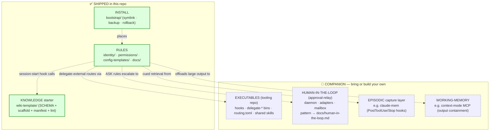
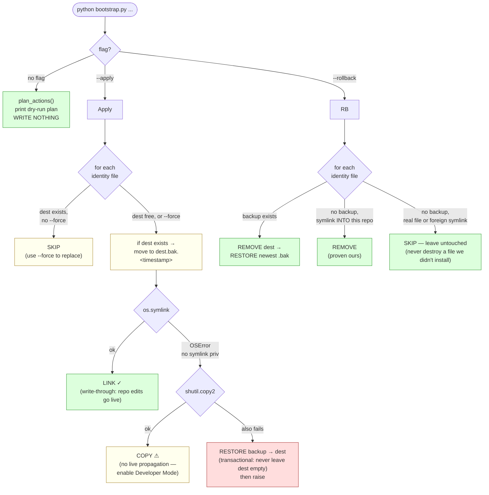
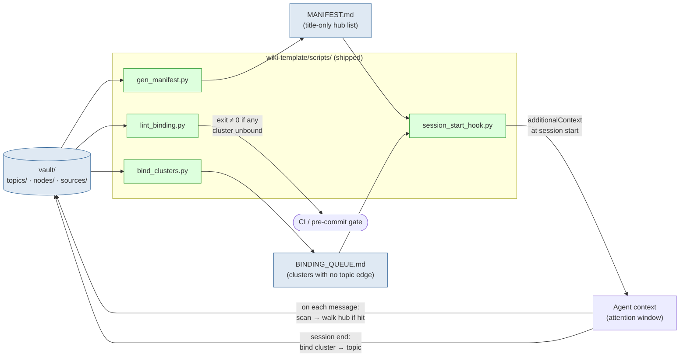

# Repo Map — file structure & the logic it drives

> **TL;DR (≤80 words):** A map of what is *actually in this repository* and how
> each file drives behavior. `INFRASTRUCTURE.md` diagrams the **deployed system**
> (four repos, companions, the running fleet). This document is narrower and more
> literal: the shipped file tree, the boundary between what ships here and what
> you bring yourself, the bootstrap install/rollback state machine, and the
> session-start data flow through the shipped wiki scripts. Read this to
> understand the box; read `INFRASTRUCTURE.md` to understand the machine the box
> joins.

---

## 1. The shipped file tree (annotated)

Every path below is tracked in this repo. Roles are grouped by the four concerns
the doctrine separates: **RULES**, **KNOWLEDGE starter**, **INSTALL**, **DOCS**.

```
hive-mind-os/
│
├── README.md                 ← human entry point (install + philosophy)
├── ONBOARDING.md             ← agent entry point (pasted into a fresh agent)
├── CONTRIBUTING.md           ← contribution + sanitisation rules (public hygiene)
├── LICENSE                   ← MIT
│
├── identity/                 ── RULES: one doctrine file per runtime ───────────
│   ├── CLAUDE.md             ← Claude Code  → ~/.claude/CLAUDE.md
│   ├── AGENTS.md             ← Codex CLI    → ~/.codex/AGENTS.md
│   ├── GEMINI.md             ← Gemini CLI   → ~/.gemini/GEMINI.md
│   └── GROK.md               ← Grok         → ~/.grok/AGENTS.md  (Grok reads AGENTS.md)
│
├── permissions/              ── RULES: versioned permission *excerpts* (keys only)
│   ├── claude-settings.permissions.json
│   ├── codex-config.permissions.toml
│   ├── gemini-settings.permissions.json
│   ├── gemini-policies/claude-mirror.toml
│   ├── grok-config.permissions.toml
│   └── README.md             ← how to MERGE excerpts into a live settings file
│
├── config-templates/         ── RULES: starter configs (full files, not excerpts)
│   ├── claude/settings.json
│   ├── codex/config.toml
│   ├── gemini/settings.json
│   ├── grok/config.toml
│   └── README.md
│
├── bootstrap/                ── INSTALL: wire identity files into runtime dirs ──
│   ├── bootstrap.py          ← cross-platform installer (dry-run default; the
│   │                            symlink/copy + backup + rollback state machine)
│   ├── setup-macos.sh        ← per-OS entry point (macOS; landmine notes in header)
│   ├── setup-linux.sh        ← per-OS entry point (Linux/WSL)
│   ├── setup-windows.ps1     ← per-OS entry point (Windows)
│   └── test_bootstrap.py     ← pytest suite for the installer
│
├── wiki-template/            ── KNOWLEDGE starter: a vault you can scaffold ─────
│   ├── SCHEMA.md             ← the node/edge/traversal protocol (canonical)
│   ├── README.md
│   ├── _templates/           ← node / cluster / session / project-wiki templates
│   └── scripts/              ← the SHIPPED wiki toolkit (+ its own tests)
│       ├── scaffold.py             ← create a fresh vault from the template
│       ├── gen_manifest.py         ← write MANIFEST.md (title-only hub list)
│       ├── bind_clusters.py        ← write BINDING_QUEUE.md (orphan clusters)
│       ├── lint_binding.py         ← CI gate: every cluster must bind to a hub
│       ├── session_start_hook.py   ← inject MANIFEST + BINDING_QUEUE at start
│       ├── requirements.txt
│       └── tests/                  ← pytest suites for the above
│
└── docs/                     ── DOCS: the protocol, deeper than the identity files
    ├── INFRASTRUCTURE.md     ← the deployed-system view (7 Mermaid diagrams)
    ├── memory-architecture.md
    ├── permissions-protocol.md
    ├── wiki-protocol.md
    ├── human-in-the-loop.md  ← relay pattern (the relay itself is NOT shipped)
    ├── hygiene.md            ← shipped vs documented-add-on wiki hygiene
    └── multi-runtime.md      ← cross-runtime parity + divergences
```

**The one structural rule:** `identity/` and `config-templates/` hold *full files*
the installer places; `permissions/` holds *excerpts* (permission keys only) that
get **merged** into a live settings file so machine-specific keys (MCP servers,
plugin marketplaces) survive. Symlink the doctrine; merge the permissions.

---

## 2. What ships here vs. what you bring

The doctrine names four concerns. This repo ships two of them outright (RULES +
a KNOWLEDGE starter) and documents the other two as **companions you bring or
build**. This boundary is the single most important thing to understand before
adopting.



**Why the split:** RULES and KNOWLEDGE are plain text — portable, auditable, no
runtime dependency. The companions are *deployable code with their own lifecycles*
(a daemon, a hook runner, an MCP server). Shipping them would couple the template
to one stack; documenting their *contracts* lets an adopter wire any equivalent.

> The seams are contracts, not imports. The session hook needs a script-runner
> (`session_start_hook.py` is the reference). The relay needs a command that
> takes `--prompt` and writes the human's reply to stdout. Meet the contract with
> whatever you already run.

---

## 3. Bootstrap logic — the install/rollback state machine

`bootstrap.py` is deliberately paranoid: it is **dry-run by default**, it **never
overwrites without a backup**, and `--rollback` **can never delete a file it
didn't create**. This diagram is the actual control flow.



**Install mapping** (`_mappings`):

| Source (this repo) | Destination (runtime) | Note |
|---|---|---|
| `identity/CLAUDE.md` | `~/.claude/CLAUDE.md` | |
| `identity/AGENTS.md` | `~/.codex/AGENTS.md`  | |
| `identity/GEMINI.md` | `~/.gemini/GEMINI.md` | |
| `identity/GROK.md`   | `~/.grok/AGENTS.md`   | Grok loads `AGENTS.md`, never `GROK.md` |

The ownership test (`_is_symlink_into_repo`) is what makes `--rollback` safe: it
resolves the link target and only reclaims a dest whose link points *inside* this
repo. A hand-written file, or a symlink you made pointing elsewhere, is left
alone.

---

## 4. Session-start data flow — the shipped wiki loop

What the KNOWLEDGE half does at the start of every session. Only the **manifest**
(Layer-1 hub titles) is injected; deeper layers are walked on demand per the Wiki
Protocol. This is the whole shipped feedback loop — no LLM, no network.



**Documented but NOT shipped** (see `docs/hygiene.md`): the per-hub `Current
truth` block reconciler and the local-LLM contradiction judge. They are described
as input-contracts so you can wire your own; the template enforces only the one
CI-safe rule — *every cluster binds to a topic hub* (`lint_binding.py`).

---

## 5. Shipped / documented-only / companion — the honest inventory

| Capability | Status | Where |
|---|---|---|
| Identity doctrine (4 runtimes) | **shipped** | `identity/` |
| Permission excerpts + merge guide | **shipped** | `permissions/` |
| Config starters | **shipped** | `config-templates/` |
| Installer (symlink/copy/backup/rollback) | **shipped** | `bootstrap/` |
| Wiki schema + scaffold | **shipped** | `wiki-template/` |
| Manifest + binding queue + binding lint | **shipped** | `wiki-template/scripts/` |
| Session-start manifest injection | **shipped** (reference impl) | `session_start_hook.py` |
| Per-hub truth blocks | documented add-on | `docs/hygiene.md` |
| Contradiction judge (local LLM) | documented add-on | `docs/hygiene.md` |
| Source-library ingest (PDF → sidecars) | **not included** | `SCHEMA.md §7` describes the workflow; bring your own ingest step |
| Delegation routing (`routing.toml`, wrappers) | companion | tooling repo (`docs/INFRASTRUCTURE.md` §6) |
| Hooks / custom bins / shared skills | companion | tooling repo |
| Approval relay (daemon + adapters) | companion | `docs/human-in-the-loop.md` |
| Episodic capture (e.g. claude-mem) | companion | `docs/memory-architecture.md` |
| Working-memory (e.g. context-mode) | companion | `docs/memory-architecture.md` |

---

## 6. The three rules, restated against this tree

1. **Symlink discipline** — `bootstrap/` makes every runtime identity file a
   symlink into `identity/`. One source of truth; `git pull` propagates.
2. **Permission discipline** — every tool call hits the resolver seeded from
   `permissions/`. Allow and hard-deny are silent; ASK escalates to the
   (companion) relay; timeout defaults to deny.
3. **Memory discipline** — identity always loaded; `wiki-template/` manifest
   injected at Layer 1; deeper layers walked on demand; episodic + working
   memory are cued/transient companions.

Two concerns ship, two you bring. The seams between them are written contracts,
not code dependencies — which is why the doctrine survives swapping any one
component out.
